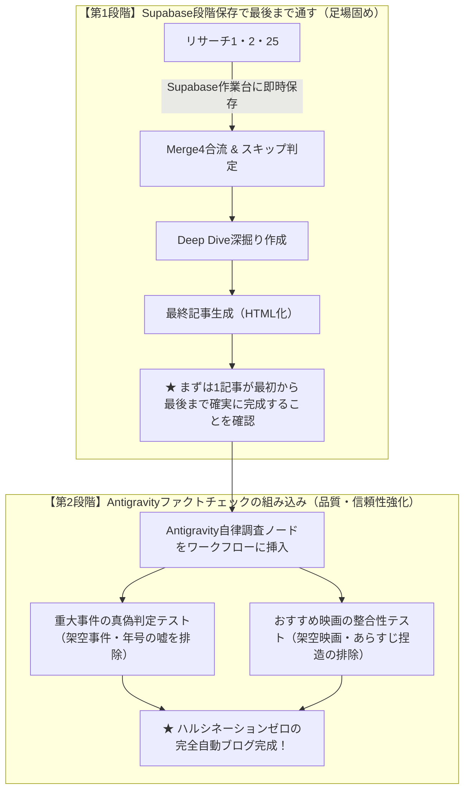

# 📋 メインブログ（ローコスト版）やることリスト ＆ 開発ロードマップ

---

## 🎯 【今後の基本戦略（2段階ロードマップ）】

**「① 各セクションをSupabaseに保存しながら最後まで一気通貫で通す」**
　⬇
**「② その後にAntigravityを組み込み、重大事件や映画のハルシネーション（嘘）を防止できるかテスト・検証する」**

---

## 🚨 【忘れないことリスト】映画「歴史クロス解説」の検証＆組み込み方針

### 1. あらすじ（TMDb）と歴史クロス解説の差別化チェック 【最重要】
* **課題・注意点**:
  * 映画データに新設した `historical_significance`（歴史クロス解説）が、TMDbの公式「あらすじ（overview）」と**似たり寄ったりのストーリー要約になっていたら読者にとって無駄・重複**になる。
* **検証＆判断基準**:
  * **残す場合**: あらすじ（粗筋）とは明確に異なり、「この映画が描く歴史の真実・当時のタブー・国家事件への批評」として独立した知的好奇心を刺激する文章になっている場合 ➜ 映画カード直下に特設ブロック（`🏛️ 歴史的背景とのリンク`）としてHTMLに美しくレイアウトする。
  * **削る場合**: 単なる映画のあらすじの言い換えにとどまっている場合 ➜ **バッサリ削る（またはあらすじに統合）**。

### 2. 記事作成（最終Code / ライター）でのエラー防止
* 新しい項目（`historical_significance` や `related_event`）が存在しなくても、記事生成コードが `undefined` エラーで落ちないよう、オプショナルチェイニング（`?.`）やフォールバック（`|| ''`）の安全処理を徹底する。

---

## 📌 【進行状況 ＆ やることリスト】

### 【フェーズ 1】Supabase段階保存で一気通貫フローを完成させる（現在地）
- [x] **Supabase作業台テーブル（`country_research_cache`）の構築**: RLSオフで一発保存・スキップ対応。
- [x] **リサーチ1（制度・地理・犯罪10大事件）**: Gemini 3.8 Flashで高精度出力＆即時保存完了。
- [x] **リサーチ2（近代史100年10大事件・最新動向）**: Gemini 3.6/3.8 Flashで完走＆即時保存完了。
- [x] **リサーチ25（歴史連動映画選定）**: 
  - [x] プロンプト（`researcher25.md`）のGemini最適化
  - [x] 整形コード（`リサーチデータ整形.js`）の超堅牢化（Gemini直接出力＆Supabaseキャッシュ両対応、国名自動継承）
  - [x] サブワークフロー「映画DB充実＿個別登録版」への個別パス（9 items）
- [x] **コスト計算（`コスト計算.js`）**: Flash 3.0〜3.8を完全自動判別し、1回約0.2〜0.5円を正確レポート。
- [ ] **Merge4（合流ノード）への配線**:
  - `★リサーチ25即時保存`（保存完了ルート）➜ `Merge4` input 2
  - `IF: 映画未取得？` の `false`（スキップ直行ルート）➜ `Merge4` input 2
- [ ] **Deep Dive（深掘りセクション）の作成**:
  - 選定基準とプロンプトの骨太化（選定理由・緊迫のタイムライン・現代への影響）。
- [ ] **最終記事生成（ライター ＆ 最終Code.js）**:
  - `country_research_cache` からリサーチ1・2・25を統合してHTML記事化。
  - 上記「歴史クロス解説」のクオリティを実物で目視確認し、レイアウト採否を決定。
- [ ] **エンドツーエンド（E2E）開通テスト**:
  - 1つの国を投入し、途中エラーなくSupabaseに各パーツが蓄積され、最終HTMLまで出力されることを確認。

---

### 【フェーズ 2】Antigravity組み込みによるハルシネーション（嘘）防止テスト
> **ブログの生命線**: GeminiもPerplexityもハルシネーション（嘘）の可能性がゼロではない。読者の信頼を守るため、記事化前にAntigravity（自律調査）による裏取り検証ノードを挟む。

- [ ] **Antigravityノードの挿入設計**:
  - 各リサーチ出力後、または最終ライター前の適切な位置にAntigravity検証ノードを配置。
- [ ] **重大事件の真偽判定テスト**:
  - 挙げられた10大事件が実在するか、年号・人物名・被害規模に捏造や脚色がないかをWeb・公的情報と自律照合できるか検証。
- [ ] **おすすめ映画の実在＆テーマ適合テスト**:
  - 架空の映画が存在しないか（TMDb/IMDbで実在確認）。
  - 本当にその歴史事件を扱った作品か（あらすじ・批評との整合性チェック）。
- [ ] **誤爆・ハルシネーション検出時の自動修正/差し替えテスト**:
  - 嘘や不確実な情報が見つかった場合、Antigravityが自律的に正しい情報に修正または差し替える動作を確認。

---
*最終更新日: 2026年9月15日*

