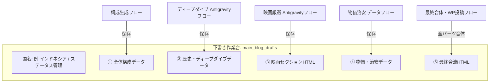

# 【基本設計概要書】メインブログ「Antigravity版」
## 〜マイクロセクション分割進行 × 自律ファクトチェック × 映画部門超強化〜

---

## 1. システム概要と開発の狙い

### ■ 目的
「国家の天秤」メインブログの制作において、**「APIコストの極限削減（無料枠の活用）」** と **「ハルシネーション（嘘）の完全排除」**、そして **「看板コーナーである映画部門の圧倒的クオリティ向上」** を同時に実現する次世代ワークフローシステム。

### ■ 従来システムからの3大進化

| 項目 | 従来のワークフロー（モノリス型） | 新システム（Antigravity版） |
| :--- | :--- | :--- |
| **リサーチAI** | Perplexity API（有料・課金が発生） | **Antigravity（Google自律エージェント / 無料枠対応）** |
| **フロー構造** | 最初から最後まで一気に走る長大フロー | **Supabaseを作業台にした「マイクロセクション分割保存」** |
| **コスト・制限対策** | 途中でレート制限（429/503）が出ると全滅 | **1回1〜2リクエストで即セーブ。無料枠制限を物理的に回避** |
| **映画選定** | LLMの記憶頼み（マイナー映画や誤爆あり） | **IMDb評価・日本国内配信・歴史合致の3重自律裏取り** |

---

## 2. コア・アーキテクチャ（作業台 ＆ 分割進行方式）

記事全体を一気に作らず、**「Supabaseを下書きパーツ置き場（作業台）」** として活用します。

### なぜ「分割進行」が最強なのか？
1. **無料枠（30 RPM）を絶対に超えない**：
   * 1つのワークフローが動くときは「映画だけ」「ディープダイブだけ」を処理。
   * API消費はたったの **1〜2リクエスト** なので、制限エラーになる可能性がゼロになります。
2. **途中でレビュー・パーツ単位の差し替えが可能**：
   * 「映画だけ別の作品に変えたい」場合、記事全体を再生成する必要はなく、「映画フロー」だけを再実行すればOK。
3. **ハイブリッド運用**：
   * **通常時**：毎日のCronで1ステップずつ自動で進める（完全0円運用）。
   * **急ぎ時**：有料アカウントキー（1,000 RPM）を指定して全フローを一気通貫で5分で完走させる。

---

## 3. 看板コーナー「映画部門」の Antigravity 強化仕様

ユーザーが最も重視する映画部門には、Antigravityの「自律調査・裏取り能力」を全開で注ぎ込みます。

### ① 3重の自律フィルター選定
AIが勝手に適当な映画を選ぶのではなく、以下のチェックをWeb検索・データ照合しながら自律実行します：
1. **実在＆名作評価チェック**：
   * IMDbスコア 6.5以上、または世界的な映画祭・映画賞の受賞歴がある「確かな名作」に限定。
2. **日本での視聴可能性チェック**：
   * 日本語タイトル（邦題）の有無、Filmarksでの評価、国内配信（Netflix, U-NEXT, Amazon等）の有無を自律確認。
   * 「読者が気になっても日本で観られない映画」を完全に排除。
3. **テーマ整合性チェック**：
   * その国の凄惨な歴史事件（虐殺、独裁、内戦など）を真正面から描いた作品であることをあらすじ・映画評から裏取り。

### ② 歴史と映画の「クロス解説」自動生成
単なるあらすじ紹介ではなく、
> **「この映画のどの描写・登場人物が、先ほど解説した◯◯事件（歴史事実）の実態を象徴しているのか？」**
> **「監督がこの作品を通じて世界に伝えたかったメッセージは何か？」**

といった、映画批評家レベルの重厚なコラム文を自律生成させます。

### ③ 予告編（YouTube）・ポスター誤爆のゼロ化
映画名・公開年・監督名をピンポイントで確定させた上で公式予告編URL・TMDb IDを取得するため、リンク切れや同名別映画の誤爆を防ぎます。

---

## 4. Supabase 作業台テーブル設計案（`main_blog_drafts`）

| カラム名 | 型 | 説明 |
| :--- | :--- | :--- |
| `id` | uuid / int | レコードID |
| `country_code` | text | 国コード（例: ID, VN, PL） |
| `country_name` | text | 国名（例: インドネシア） |
| `current_step` | int | 0:未着手, 1:構成済, 2:歴史済, 3:映画済, 4:物価済, 5:合流済 |
| `section_outline` | jsonb | 全体構成・論点メモ |
| `section_deepdive` | jsonb | 歴史・対立軸・出典URLリスト（Antigravity生成） |
| `section_movie` | jsonb | 厳選映画データ（邦題, 原題, IMDb, 解説HTML, 予告編URL） |
| `section_bukka_chian` | jsonb | 物価・治安データ |
| `final_article_html` | text | 全セクション合体済みの完全版WordPress用HTML |
| `status` | text | draft（下書き中）/ ready（公開準備完了）/ published（公開済） |
| `updated_at` | timestamp | 最終更新日時 |

---

## 5. 今後の開発ロードマップ

* [ ] **ステップ 1（明日）**：
  * 「推し巡回ニュース（韓国語）」の45名Supabase同期＆自動バッチを完成させる。
* [ ] **ステップ 2**：
  * Antigravity を使った「映画自律厳選＆クロス解説生成」の単体テスト（HTTP Request）。
* [ ] **ステップ 3**：
  * Supabaseに `main_blog_drafts` テーブルを設置。
* [ ] **ステップ 4**：
  * セクションごとの独立ワークフロー（映画、ディープダイブ、合流）を順次構築。
* [ ] **ステップ 5**：
  * 完全無料枠・日次分割進行によるメインブログ自動運用の稼働開始！
