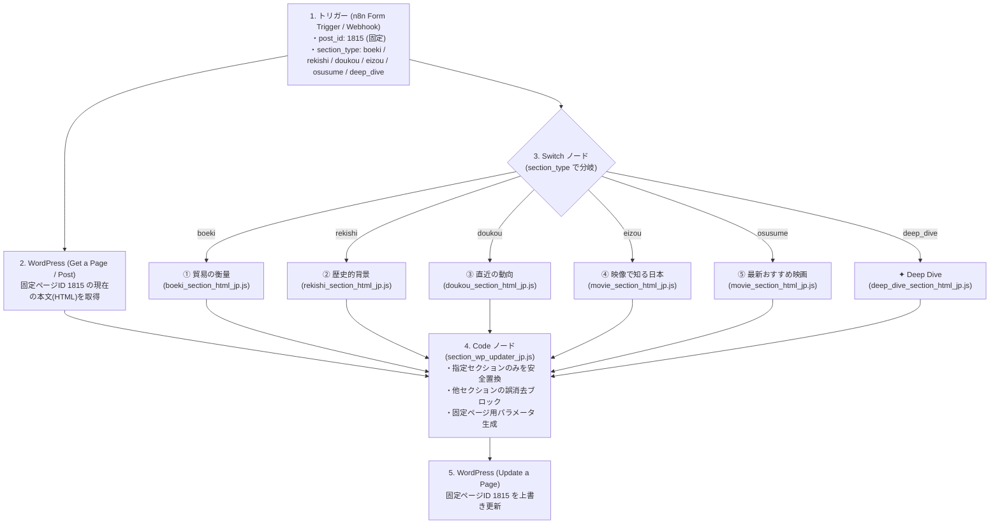

# 日本版 固定ページ各セクション生成・個別更新サブワークフロー 設計ガイド

本ドキュメントは、**「国家の天秤」日本版（固定ページ ID: 1815 / URL: `/日本/`）** の各セクションをピンポイントで生成・個別上書き更新するためのサブワークフロー設計書です。

---

## 🗺️ ワークフロー全体構成図

---

## ⚙️ 各ノードの設定詳細

### 1. トリガー（n8n Form Trigger の場合）
* **Path**: `japan-section-update`
* **フォーム項目**:
  1. `post_id` (Number): 初期値 `1815`（日本の固定ページID）
  2. `section_type` (Dropdown / Text):
     - `eizou` : ④ 映像で知る日本
     - `osusume` : ⑤ 日本の最新おすすめ映画
     - `doukou` : ③ 直近の動向
     - `rekishi` : ② 歴史的背景
     - `boeki` : ① 貿易の衡量
     - `deep_dive` : ✦ Deep Dive
  3. `content_data` (Textarea, 任意):
     - 動向のテキスト一括貼り付けや、手動入力用。空の場合はAIリサーチやSupabaseから自動取得。
  4. `neko_comment` (Text, 任意): エラーネコの一言を手動指定したい場合に入力。

---

### 2. WordPress 現在の本文取得ノード
* **Node Type**: `WordPress`
* **Resource**: `Page` (または `Post`)
* **Operation**: `Get`
* **Page ID**: `1815` (または `={{ $json.post_id || 1815 }}`)

---

### 3. Switch ノードの分岐設定
モード: **Rules**

| ルール名 | 条件式 | 宛先 |
| :--- | :--- | :--- |
| **boeki** | `{{ $json.section_type }}` Equal `boeki` または `1` | `boeki_section_html_jp.js` |
| **rekishi** | `{{ $json.section_type }}` Equal `rekishi` または `2` | `rekishi_section_html_jp.js` |
| **doukou** | `{{ $json.section_type }}` Equal `doukou` または `3` | `doukou_section_html_jp.js` |
| **eizou** | `{{ $json.section_type }}` Equal `eizou` または `4` | `movie_section_html_jp.js` |
| **osusume** | `{{ $json.section_type }}` Equal `osusume` または `5` | `movie_section_html_jp.js` |
| **deep_dive** | `{{ $json.section_type }}` Equal `deep_dive` | `deep_dive_section_html_jp.js` |

---

### 4. 各セクションHTML生成ノード一覧

| ファイル名 | 対象セクション | 主な機能 |
| :--- | :--- | :--- |
| **[section_wp_updater_jp.js](file:///c:/Users/shiny/.gemini/antigravity/scratch/n8n-prompts/prompts/blog/各セクション生成・個別更新サブワークフロー日本版/section_wp_updater_jp.js)** | 最終合流・置換 | マーカー置換、他セクション誤消去防止ガード、固定ページ（ID: 1815）パラメータ出力 |
| **[movie_section_html_jp.js](file:///c:/Users/shiny/.gemini/antigravity/scratch/n8n-prompts/prompts/blog/各セクション生成・個別更新サブワークフロー日本版/movie_section_html_jp.js)** | ④映像 / ⑤おすすめ映画 | 最新地図URL（`map.seronworks.dev`）、ポスター、YouTube予告編、IMDbボタン、▲先頭に戻る |
| **[doukou_section_html_jp.js](file:///c:/Users/shiny/.gemini/antigravity/scratch/n8n-prompts/prompts/blog/各セクション生成・個別更新サブワークフロー日本版/doukou_section_html_jp.js)** | ③ 直近の動向 | 政治経済社会、驚きの統計習慣、国際社会との関連、出典、エラーネコ、▲先頭に戻る |
| **[rekishi_section_html_jp.js](file:///c:/Users/shiny/.gemini/antigravity/scratch/n8n-prompts/prompts/blog/各セクション生成・個別更新サブワークフロー日本版/rekishi_section_html_jp.js)** | ② 歴史的背景 | 近代100年テーブル（戦争・事件・政治）、エラーネコ、▲先頭に戻る |
| **[boeki_section_html_jp.js](file:///c:/Users/shiny/.gemini/antigravity/scratch/n8n-prompts/prompts/blog/各セクション生成・個別更新サブワークフロー日本版/boeki_section_html_jp.js)** | ① 貿易の衡量 | 輸出入トップ10、相手国トップ10、解説文、エラーネコ、▲先頭に戻る |
| **[deep_dive_section_html_jp.js](file:///c:/Users/shiny/.gemini/antigravity/scratch/n8n-prompts/prompts/blog/各セクション生成・個別更新サブワークフロー日本版/deep_dive_section_html_jp.js)** | ✦ Deep Dive | ディープダイブ長文記事、出典整形、▲先頭に戻る |

---

### 5. WordPress 固定ページ更新ノード
* **Node Type**: `WordPress`
* **Resource**: `Page` (固定ページ)
* **Operation**: `Update`
* **Page ID**: `1815` (または `={{ $json.id }}`)
* **Content**: `={{ $json.content }}`
