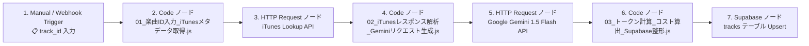

# 🎵 韓国語歌詞・語学学習自動生成ワークフロー 構築手順書
〜 楽曲ID入力からiTunes連携・AI精密対訳・円換算コスト表示・Supabase自動保存まで 〜

## 📌 概要
PlaceInfo（ヒストリーギャラリー）の音楽モードに表示される **「楽曲ID（例: `1648228862`）」** をトリガーに入力するだけで、
1. **iTunes 公式 API** より曲名・アーティスト・アルバム名・600x600高画質ジャケット・試聴音源URLを自動取得
2. **Gemini 1.5 Flash (AI)** が、韓国語学習アプリ「K-Learner」仕様に合わせて、
   - フレーズごとの正確なハングル (`ko`)
   - 日本語の自然で美しい対訳 (`ja`)
   - 正確な発音ルビ (`rubi`)
   - 単語ホバー（Tango Hover）連動の重要単語帳 (`vocab`)
   - 歌詞に出てくる生きた文法・助詞 (`grammar`)
   - 楽曲背景・感情表現の深掘りノート (`lyrics_notes`)
   を完全自動生成
3. **消費トークン数から「何円かかったか（日本円コスト）」を瞬時に算出・表示**
4. **Supabase の `tracks` テーブルへ自動 Upsert 保存**

---

## 🗺️ 全体ノード構成 (Flow Chart)



---

## 🛠️ 各ノードの設定手順

### 1. トリガーノード: `Manual Trigger` または `Webhook`
- **Manual Trigger** でテスト実行する場合:
  - 実行時に `track_id` を指定します（例: `1648228862`）。
- **Webhook** で外部（ブラウザ等）から実行する場合:
  - Method: `POST` または `GET`
  - パラメータ: `track_id`

---

### 2. Code ノード: `01_楽曲ID入力_iTunesメタデータ取得`
- **Mode**: `Run Once for All Items`
- **Language**: `JavaScript`
- **コード**: 同フォルダの `01_楽曲ID入力_iTunesメタデータ取得.js` の内容を貼り付けます。

---

### 3. HTTP Request ノード: `iTunes Lookup API`
- **Method**: `GET`
- **URL**: `={{ $json.itunes_lookup_url }}`
- **Authentication**: `None`
- **Response Format**: `JSON`

---

### 4. Code ノード: `02_iTunesレスポンス解析_Geminiリクエスト生成`
- **Mode**: `Run Once for All Items`
- **Language**: `JavaScript`
- **コード**: 同フォルダの `02_iTunesレスポンス解析_Geminiリクエスト生成.js` の内容を貼り付けます。
- **ノード名**: `iTunesレスポンス解析` と命名してください（後続ノードで参照します）。

---

### 5. HTTP Request ノード: `Google Gemini 1.5 Flash API`
※ LangChainのGeminiノード、または HTTP Request ノードで直接呼び出せます。HTTP Request 直接呼び出しが最もトークン取得が確実でおすすめです。

- **Method**: `POST`
- **URL**:
  ```text
  https://generativelanguage.googleapis.com/v1beta/models/gemini-1.5-flash:generateContent?key=YOUR_GEMINI_API_KEY
  ```
  *(※ `YOUR_GEMINI_API_KEY` をご自身の Google AI Studio APIキーに置き換えてください)*
- **Send Headers**:
  - `Content-Type`: `application/json`
- **Send Body**: `true`
- **Body Content Type**: `JSON`
- **Specify Body**: `Using JSON`
- **JSON**: `={{ JSON.stringify($json.gemini_request) }}`

---

### 6. Code ノード: `03_トークン計算_コスト算出_Supabase整形`
- **Mode**: `Run Once for All Items`
- **Language**: `JavaScript`
- **コード**: 同フォルダの `03_トークン計算_コスト算出_Supabase整形.js` の内容を貼り付けます。

#### 💡 コスト計算の仕組み
実行すると、n8nの実行結果画面（OUTPUT）およびコンソールに以下のようなレポートが表示されます：

```text
┌────────────────────────────────────────────────────────┐
│ 🎵 歌詞学習データ生成完了 & コストレポート             │
├────────────────────────────────────────────────────────┤
│ 楽曲: 다시 너를 (Once Again) (김나영, 매드클라운)
│ モデル: gemini-1.5-flash
│ 入力トークン: 1,320 tokens ($0.000099)
│ 出力トークン: 980 tokens ($0.000294)
│ 合計トークン: 2,300 tokens
├────────────────────────────────────────────────────────┤
│ 💵 発生コスト(USD): $0.000393
│ 💴 発生コスト(日本円): 約 0.061 円
└────────────────────────────────────────────────────────┘
```
- 出力JSONの `cost_summary.message` に **`💰 今回の生成コスト: 約 0.061 円 (2,300 tokens)`** と分かりやすく返ってきます。
- 1曲あたりわずか **約0.05円〜0.08円** で最高峰の教材データが生成されます。

---

### 7. Supabase ノード: `tracks テーブル Upsert`
- **Resource**: `Row`
- **Operation**: `Create or Update (Upsert)`
- **Table**: `tracks`
- **Match Column**: `track_id`
- **Data to Send**: `Define Below`
- **Fields**:
  - `track_id`: `={{ $json.supabase_record.track_id }}`
  - `track_name`: `={{ $json.supabase_record.track_name }}`
  - `track_name_en`: `={{ $json.supabase_record.track_name_en }}`
  - `artist_name`: `={{ $json.supabase_record.artist_name }}`
  - `artist_name_en`: `={{ $json.supabase_record.artist_name_en }}`
  - `album_cover`: `={{ $json.supabase_record.album_cover }}`
  - `preview_url`: `={{ $json.supabase_record.preview_url }}`
  - `itunes_url`: `={{ $json.supabase_record.itunes_url }}`
  - `description`: `={{ $json.supabase_record.description }}`
  - `lyrics`: `={{ $json.supabase_record.lyrics }}`
  - `country`: `KR`
  - `genre`: `Ballad`
  - `updated_at`: `={{ $json.supabase_record.updated_at }}`

---

## 📱 アプリ側での確認方法
1. n8nワークフローを実行して「SUCCESS」になるのを確認します。
2. 韓国語学習アプリ `Korean-Learner` を開き、画面右上の「🔄 更新」またはリロードを行います。
3. 登録した楽曲が自動的にハブチップの先頭に表示され、クリックすると：
   - 1文ごとの対訳（日・韓・カタカナルビ）
   - 単語ホバー（Tango Hover）の緑ハイライト
   - 重要文法・楽曲解説
   が美しく表示されます！
